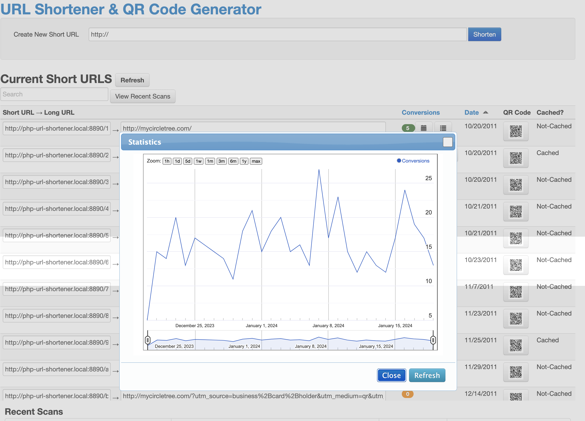

# URL Shortening Service

License: http://www.gnu.org/licenses/gpl-2.0.html

Benefits

- Can shorten over 42 billion unique URLs in 6 or less characters (it can do more than 12,000,000 in only 4!)
- Super duper fast—uses very little server resources
- Includes an API so you can create your own short URLs on the fly
- Option to turn clickthru tracking on and off
- Option to limit usage to 1 IP address for personal use and to prevent spamming from others
- Only uses alphanumeric characters so all browsers can interpret the URL
- Secure—several data filters in place to prevent SQL injection hacks
- Option to check if the URL is real (doesn’t respond with a 404) before shortening
- Uses 301 redirects for SEO and analytics yumminess
- Option to store a local cache to prevent database queries on every redirect
- Option to change the characters allowed in a shortened url

Installation

1. Make sure your server meets the requirements:
    a) Optionally you can run this from your current domain or find a short domain
    b) Apache
    c) PHP
    d) MySQL
    e) Access to run SQL queries for installation
2. Download a .zip file of the PHP URL shortener script files
3. Upload the contents of the .zip file to your web server
4. Update the database info in config.php
5. Run the SQL included in shortenedurls.sql. Many people use phpMyAdmin for this, if you can’t do it yourself contact your host.
6. Rename rename.htaccess to .htaccess
7. If you want to use the caching option, create a directory named cache with permissions 777

Using your personal URL shortener service

- To manually shorten URLs open in your web browser the location where you uploaded the files.
- To programmatically shorten URLs with PHP use the following code:
    $shortenedurl = file_get_contents('http://yourdomain.com/shorten.php?longurl=' . urlencode('http://' . $_SERVER['HTTP_HOST']  . '/' . $_SERVER['REQUEST_URI']));
